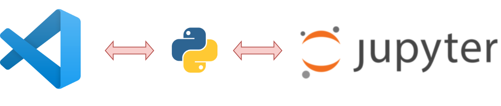

<p align="center">
    
</p>

## Hi,
### AVM stundets

1. Please use the files in this repo as reference.
2. Code that is being thaught in the class will be available here as well.
3. Once you are done testing the code that was taught, Students only need to make changes to the logic part to complete the activities.

<br>
<br>
<br>

<hr style="height:2px;">

# Setting up your computer

There are multiple ways in which we can set up your computer to code in python. But the few of the  recommended ways is to use Jupyter notebook or VS code. Other options include IDLE the pythons built in editor, Atom or PyCharm.

The reason we want to use an editor is to use the extensive features provided by them which include code auto completion, easy to run and see output and many more..

<hr style="height:2px;">
<p align="center">
    
</p>
<hr style="height:2px;">


<br>
<br>

### Setting up Python

Setting up python is a very easy process all you need to do is download the installer from the <a href=https://www.python.org/downloads/>official website</a>

*Windows user please note to check the box which says 'add to path' when the installer is launched as highlighted in the below image*


<hr style="height:2px;">

<br>
<br>

### Setting up VS code

Visual studio code is a popular editor by microsoft. It supports majority of the programming langauages. it also some with an extension store where we can install add on to help us customize the look and the features. Again it requires you to have python installed and working. Please follow the steps in jupyter notebook installation to check if python is installed and working properly.


#### Follow the below steps to install and setup VS code.

1. Download the installer using the following link. <a href=https://code.visualstudio.com/> VS code </a>
2. Run the installer and follow the on screen instruction. keep all the default settings.
3. once the first 3 steps are completed follow the below video to setup Vs code for python. *if not visible go to the videos folder*

https://github.com/rejin-omotec/AVM-DD/blob/master/videos/vs_code_setup.mp4

<br>
<br>

## Accessing Jupyter notebook inside VS code

Once VS code is installed and setup. We can directly use the jupyter notebook enviornment provided by VS code.

1. Create a new file.
2. From the dropdown select Jupyter notebook.
3. Try writing a single line of code 
```python
print("Hello world")
```
4. Use `Shift + Enter` to run the code cell.
5. A prompt will appear asking you to install the jupyter extension. Click yes to accept. *It usualy take about 5 min it to get installed*